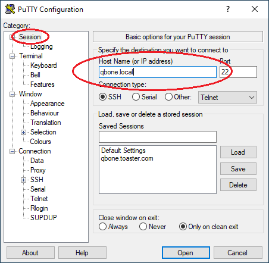
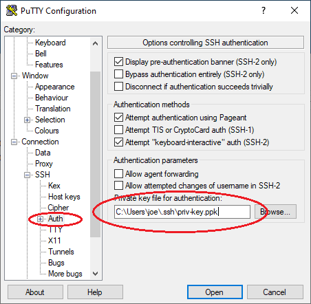

# QUniBoot Setup Guide

This document describes how to install, configure and connect to a QUniBoot system.

- [Image Download and Installation](#image-download-and-installation)
  - [Installing on Linux](#installing-on-linux)
  - [Installing on macOS](#installing-on-macos)
  - [Installing on Windows](#installing-on-windows)
- [Auto-Configuration](#auto-configuration)
- [Accessing the System](#accessing-the-system)
  - [Connecting via SSH](#connecting-via-ssh)
  - [Connecting via UART2](#connecting-via-uart2)
  - [Connecting via the System Console](#connecting-via-the-system-console)
- [Upgrading](#upgrading)

---


## Image Download and Installation

Prebuilt images for QUniBoot are available for download at
[https://github.com/jaylogue/QUniBoot/releases](https://github.com/jaylogue/QUniBoot/releases).

Separate images exist for each hardware type (`unibone` and `qbone`).
Additionally, for each hardware type there are two variants:

- `full`: OS, system files, boot files and all PDP-11 software and 
  disk images.
- `os-only`: OS, system and boot files only.

When performing a fresh install, select one of the `full` variants:

- `quniboot-unibone-full.img.gz`
- `quniboot-qbone-full.img.gz`

Installing QUniBoot requires a 2GB or larger micro-SD card. If a larger card is used,
QUniBoot will automatically expand to make use of the available space.

> **WARNING**: Writing an image to an SD card will overwrite existing data
> on the card. Be sure to have adequate backups before you start.


### Installing on Linux

1. Insert the SD card and identify its device name:

   ```
   lsblk
   ```

   Look for the disk entry matching the size of your SD card (e.g.
   `/dev/sdb`). Do not use a partition name (e.g. `/dev/sdb1`).

2. Write the image:

   ```
   zcat quniboot-<hardware>-<variant>.img.gz | sudo dd of=/dev/sdX bs=4M status=progress iflag=fullblock oflag=direct
   ```

   Replace `/dev/sdX` with the device name found in step 1.

3. When the write finishes, eject the disk:

   ```
   sudo eject /dev/sdX
   ```

### Installing on macOS

1. Insert the SD card and identify its device name:

   ```
   diskutil list
   ```

   Look for the disk entry matching the size of your SD card (e.g.
   `/dev/disk4`).

2. Unmount the disk (this does not eject it):

   ```
   diskutil unmountDisk /dev/diskN
   ```

3. Write the image. Note the use of the raw device `/dev/rdiskN` instead of the block device `/dev/diskN`:

   ```
   gzcat quniboot-<hardware>-<variant>.img.gz | sudo dd of=/dev/rdiskN bs=4M status=progress iflag=fullblock oflag=fsync
   ```

   Replace `diskN` with the disk identifier found in step 1.

4. When the write finishes, eject the disk:

   ```
   diskutil eject /dev/diskN
   ```

### Installing on Windows

Windows has no built-in tool for writing raw disk images, so a third-party
imaging tool is required, such as [balenaEtcher](https://etcher.balena.io/).

1. Download and install balenaEtcher, if not already installed. (You can
   also use Rufus for this).

2. Insert the SD card.

3. Launch Etcher and select the QUniBoot image file
   (`quniboot-<hardware>-<variant>.img.gz`) as the source.

4. Select your SD card as the target drive.

   Etcher only lists removable drives, which helps prevent accidentally
   writing to the wrong disk. Confirm the drive matches the size of your
   SD card before continuing.

5. Click **Flash** to write the image. Etcher verifies the write and
   ejects the SD card automatically when finished.


## Auto-Configuration

QUniBoot provides a feature to automatically configure important system 
settings at boot time. This feature can be used to configure a newly 
installed system image, or reconfigure an existing system.

Auto-configuration works by looking for a file called `autoconfig.txt` in
the `BOOT` partition of the SD card. If present, the system will read the file
and update its configuration based on the values therein.

An example auto-configuration file (`autoconfig-example.txt`) is included in 
the `BOOT` partition of the stock QUniBoot image.

To enable auto-configuration:
 
1. Insert the SD card into your computer and wait for the `BOOT` drive
   to appear.

   *NOTE: If you just installed a new QUniBoot image on the card, you may need to
   remove and re-insert it in order to get the `BOOT` drive to appear.*

2. Open the `BOOT` drive and copy the `autoconfig-example.txt` file to a
   new file called `autoconfig.txt`.

3. Open the `autoconfig.txt` file with a text editor. Uncomment (remove the
   #) and fill in the settings with appropriate values for your system. Follow the
   descriptions in the file to understand the purpose and syntax of each setting.

   Note that it is not necessary to provide values for every setting. Any value
   not set will leave the existing/default configuration in place.
      
   Indeed, on a new system, it is not necessary to change *any* of the system 
   settings, as the default values are entirely sufficient to use the system.
   However, for security reasons, it is strongly encouraged to set at least one
   of the following values:
   
   - `ROOT_PASSWORD` — Set the root user password
   
   - `ROOT_AUTHORIZED_KEY` — Set an authorized SSH key for the root user

4. When done editing, close the file and safely eject the SD card.

5. Insert the card into the UniBone/QBone and boot the PDP-11 system.

If auto-configuration completes successfully, the system will flash the UniBone/QBone
LEDs 3 times. If an error occurs, the system will light the LEDs and leave them on.
After a failure, the system log file (/var/log/messages) can be inspected to determine
the cause.

Once auto-configuration completes, the system will rename the `autoconfig.txt` file to
`autoconfig-completed.txt` to ensure it doesn't get re-applied at the next
boot.


## Accessing the System

Once booted, there are three ways to access the system:

- Via the network using SSH
- Via UART2
- Via the System Console

### Connecting via SSH

Perhaps the easiest way to interact with a QUniBoot system is to connect over the local-area
network using SSH. Any SSH-capable client will work as long as it is connected to the
same LAN as the UniBone/QBone.

When connected to a network, QUniBoot advertises itself via mDNS using the name
`<hostname>.local`. The hostname part defaults to either `unibone` or `qbone`, unless
overridden via the `HOSTNAME` auto-config setting.

If you set up an SSH public key using the `ROOT_AUTHORIZED_KEY` setting, then you must
supply the corresponding private key when connecting. If you did not set an SSH key,
you can log in using the root password.

On Linux and macOS, you can use the system's ssh client to connect to QUniBoot:

```
ssh root@unibone.local
```

On Windows, you can use PuTTY or another suitable SSH client:






### Connecting via UART2

At boot time, QUniBoot automatically starts a root shell on the BeagleBone's UART2
serial port (/dev/ttyS2). UART2 is accessible via an IDC header on the UniBone/QBone.
The port is configured for 115200 baud, 8 bits, no parity, 1 stop bit.

To connect an RS-232 terminal or a PC with a USB-to-RS-232 adapter, you will need a
10-pin IDC to DB25 or DE9 cable. This is a standard "PC-style" cable with a
straight-through ribbon cable connection.

Depending on how your terminal or USB adapter is configured, you will likely also
need a null-modem cable or adapter.

### Connecting via the System Console

The QUniBoot system console is connected to the BeagleBone's UART0 serial port.
UART0 is exposed on the BeagleBone's Serial Debug Header (labeled J1) which is
located on the top of the BBB PCB, but oriented towards the bottom when installed
on the UniBone/QBone.

The system console receives log messages from the bootloader and kernel as the
system boots. Once booting completes, the system starts a root shell on the port.

The serial console can be accessed using a USB to TTL 3.3V serial adapter.
The port is configured for 115200 baud, 8 bits, no parity, 1 stop bit.

Connect the adapter to the J1 header as follows:

| BBB J1 Pin | Serial Connection | Typical Wire Color |
|---|---|---|
| 1 | Ground | Black |
| 4 | Receive | White |
| 5 | Transmit | Green |

> **WARNING**: The BeagleBone Black is quite susceptible to ground currents.
> Before connecting a serial adapter to UART0 it is strongly encouraged to first
> check for any voltage potential between the ground on the computer's USB
> connector and a ground point on the PDP-11. Any significant voltage between the
> two points should be investigated and eliminated **before** the serial
> connection is made.


## Upgrading

The QUniBoot system can be upgraded by writing a new **os-only** image over an
existing QUniBoot SD card. The upgrade process replaces the OS and `BOOT` partitions
on the card, but leaves the partition holding the PDP-11 disk images and script
files (essentially everything under /root) intact.

Upgrading an existing QUniBoot system will reset all core system settings, including
the root password, SSH keys and network configuration. So you will need to reapply 
those settings once the update completes.

If you used the auto-configuration mechanism to configure the system initially, you
can preserve the original settings prior to upgrading and then re-apply them when the
upgraded system boots.

To upgrade a QUniBoot system:

1. If you used auto-configuration to set up the system originally, and you want to
   preserve those settings on the upgraded system, insert the SD card into a computer
   and save a copy of the `autoconfig-completed.txt` file (located in `BOOT` partition)
   to a local disk.

2. Follow the steps in [Image Download and Installation](#image-download-and-installation) to
   select and install the appropriate **os-only** image for your hardware:

   - `quniboot-unibone-os-only.img.gz` or
   - `quniboot-qbone-os-only.img.gz`

3. Before booting the upgraded SD card, copy the saved `autoconfig-completed.txt` file
   from step 1 into the `BOOT` partition on the upgraded card and rename the file
   to `autoconfig.txt`. (Note that you may need to remove and re-insert the SD card
   to get the `BOOT` partition to appear).

4. If needed, follow the steps in [Auto-Configuration](#auto-configuration) to
   adjust the system configuration.

5. Safely eject the SD card.

6. Insert the card into the BeagleBone Black and boot the PDP-11 system.
